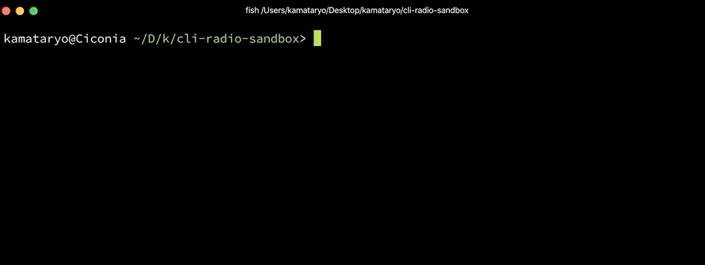

# @kamataryo/cli-radio

## install

```shell
$ npm install @kamataryo/cli-radio
# or
$ yarn add @kamataryo/cli-radio
```

## usage

```typescript
// TypeScript example
import select from "@kamataryo/cli-radio";

const main = async () => {
  const answer = await select(["foo", "bar", "baz"]);
};

main();
```

```shell
# an one-liner to try `@kamataryo/cli-radio`
$ npm install @kamataryo/cli-radio && node -e "require('@kamataryo/cli-radio').default(['foo', 'bar', 'baz'])"
```


